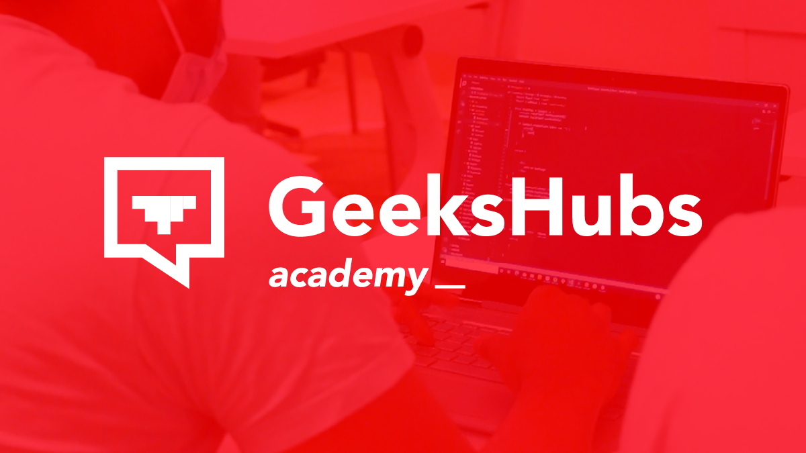
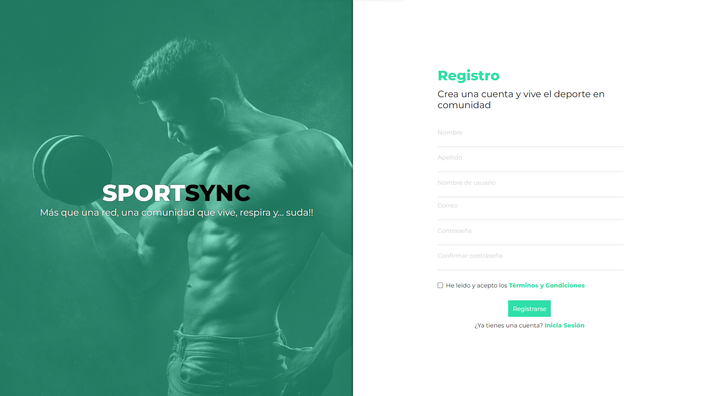
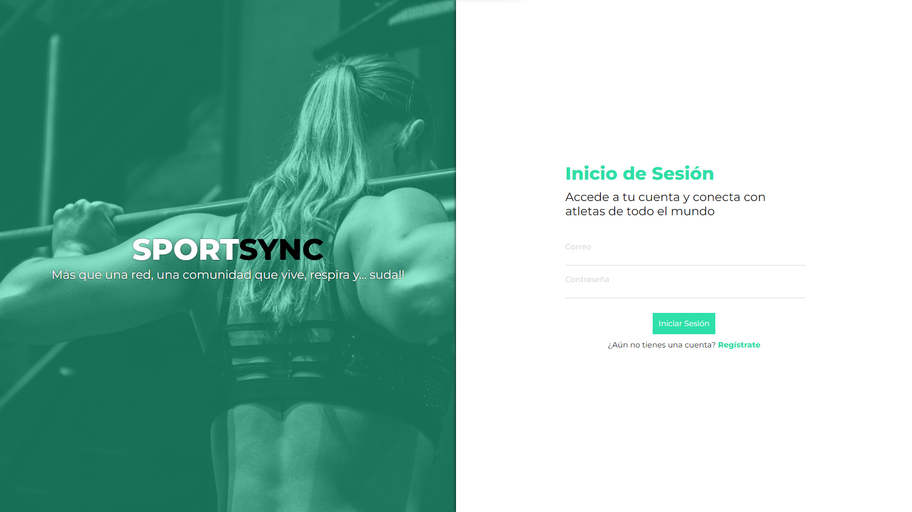
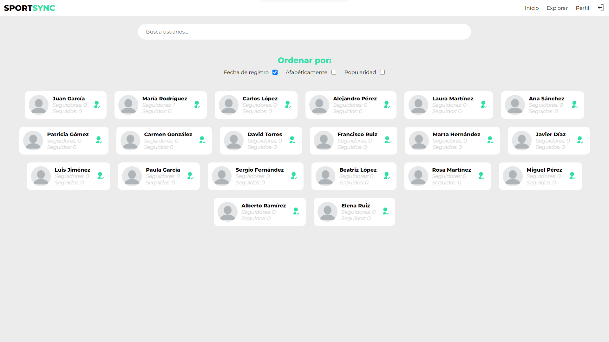
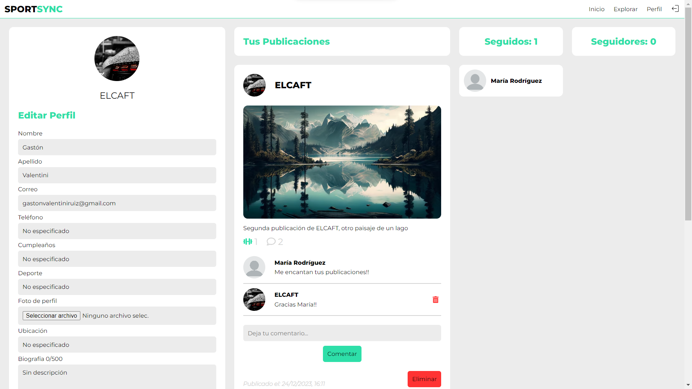
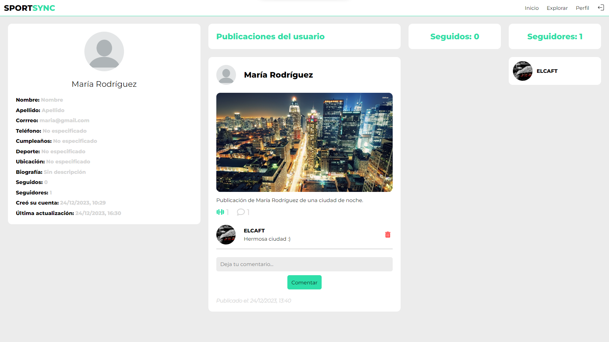
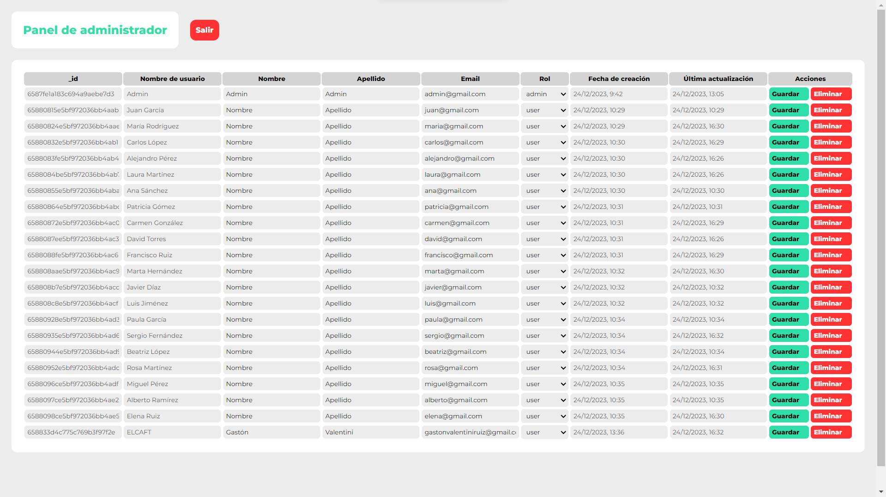

<h1 align="center"># README.md - ⚽SPORTSYNC🏀</h1>

**<p align="center">Proyecto Final - GeeksHubs Academy</p>**

**<p align="center">Aplicación en Producción</p>**

<p align="center">Aplicación Full-Stack SPORTSYNC - Gastón Valentini.

<p>
   <div align="center">
      
   </div>    
</p>
<p>
   <div align="center">
      <em><b>Bienvenido a mi proyecto</b></em>
   </div>   
<p align="center">_______________________________________________</p>

**SPORTSYNC** se trata de una red social originada con el fin de conectar a personas que les guste el deporte, donde podrán publicar información propia e interaccionar con el resto de usuarios.

<p>
   <div align="center">
      
   </div>    
</p>

## 📋 Contenido del Readme

<details>
  <summary>Apartados</summary>
<ol>
    <li><a href="#objetivo">🎯 Objetivo</a></li>
    <li><a href="#contenido-del-proyecto">💻 Contenido del proyecto</a></li>
    <li><a href="#diseño-responsive">🎨 Diseño responsive</a></li>
    <li><a href="#tecnologías-utilizadas">🔧 Tecnologías utilizadas</a></li>
    <li><a href="#ramas-del-repositorio">🍃 Ramas del repositorio</a></li>
    <li><a href="#instrucciones-de-uso">⚙️ Instrucciones de Uso</a></li>
    <li><a href="#futuras-funcionalidades">🚄 Futuras funcionalidades</a></li>
    <li><a href="#deploy">🚀 Deploy</a></li>
    <li><a href="#cómo-contribuir">🤝 Cómo contribuir</a></li>
    <li><a href="#autor">👨‍💻 Autor</a></li>
    <li><a href="#agradecimientos">👏 Agradecimientos</a></li>
  </ol>

</details>

## Objetivo

El objetivo de este proyecto es poner a prueba todo lo aprendido en el bootcamp de desarrollo web full-stack de GeeksHubs, demostrando tanto los conocimentos asquiridos para desarrollar servidores y bases en el backend, como para el desarrollo de interfaces gráficas para la interacción del cliente en el frontend.

## Contenido del Proyecto

<details>
<summary>Vistas de las que está constituida la página.</summary>
<br>

**1. Register y Login**: Estas son las únicas vistas públicas, en las cuales los usuarios podrán crear una cuenta e iniciar sesión en una cuenta ya existente.

<p>
   <div align="center">
      
      
   </div>    
   <div align="center">
      <em><b>Formularios de Registro e Inicio de Sesión</b></em>
   </div>   
</p>

**2. Home**: Es la vista principal, donde se verán todas las publicaciones que los usuarios hagan y se podrá interactuar con ellas. Adicionalmente se podrá hacer una publicación y se verán los datos del usuario que ha iniciado sesión.

<p>
   <div align="center">
      
   </div>    
   <div align="center">
      <em><b>Lista de publicaciones y componente para publicar</b></em>
   </div>   
</p>

**3. Explore**: En esta vista se pueden descubrir nuevos usuarios que existan en la aplicación y se podrán buscar, ordenar, seguir o dejar de seguir y visitar el perfil.

<p>
   <div align="center">
      
   </div>    
   <div align="center">
      <em><b>Tarjetas de los usuarios</b></em>
   </div>   
</p>

**4. Profile**: Vista propia del usuario, donde se podrá modificar la información del mismo, ver las publicaciones que ha hecho y ver tanto los seguidores como los usuarios a los que sigue.

<p>
   <div align="center">
      
   </div>    
   <div align="center">
      <em><b>Perfil del usuario</b></em>
   </div>   
</p>

**5. User**: Es la vista en la cual se muestra el perfil de otro usuario con sus publicaciones y su información.

<p>
   <div align="center">
      
   </div>    
   <div align="center">
      <em><b>Perfil de algún usuario que se visite</b></em>
   </div>   
</p>

**6. Admin**: Este es un panel solamente accesible para usuarios con dicho rol, en el cual se puede acceder a la información de todos los usuarios, editarla y eliminar usuarios.

<p>
   <div align="center">
      
   </div>    
   <div align="center">
      <em><b>Panel de administrador</b></em>
   </div>   
</p>

<p>
   <div align="center">
      
   </div>    
   <div align="center">
      <em><b>Introduce tus nuevos datos de usuario</b></em>
   </div>   
</p>

## Diseño Responsive

Todo el diseño del sitio web es responsive, lo que significa que se adapta a diferentes dispositivos y tamaños de pantalla gracias al uso de display flex y de media querys. Esto garantiza una experiencia de usuario óptima tanto en computadoras de escritorio como en dispositivos móviles.

## Tecnologías Utilizadas

<details>
<summary>Tecnologías.</summary>

-   React: 
-   Express: 
-   MongoDB: 
-   Node: 
-   Postman: 
-   Git: 
-   GitHub: 
-   JWT: 

</details>

## Ramas del Repositorio

Este proyecto se ha desarrollado en 2 ramas:

-   Rama dev: Utilizada para el desarrollo del proyecto ya que ha sido un desarrollo individual.
-   Rama master: Rama principal del proyecto, la cual es la encargada del despliegue.

## Instrucciones de Uso

<details>
<summary>Instrucciones.</summary>

1. Clona este repositorio en tu máquina local usando el siguiente comando: `git clone [URL del repositorio]`.

2. Accede a la carpeta cliente con el comando `cd /client` y ejecuta el comando `npm i` para instalar las dependencias del proyecto cliente.

3. Ejecuta el comando `npm run dev` para iniciar la aplicación.

4. Abre una nueva terminal y accede a la carpeta del servidor con el comando `cd /server` y ejecuta el comando `npm i` para instalar las dependencias del proyecto servidor.

5. Crea en la raíz un archivo llamado .env y coloca las credenciales de acceso a la base de datos, y configura el puerto del servidor.

6. Disfruta de una página web completamente funcional, publica, comenta y descubre personas increíbles!!.
 </details>

## Futuras Funcionalidades

-   Chat en tiempo real entre usuarios.
-   Editar publicación y comentario.
-   Mejora en la estructura del código.
-   Eventos.
-   Integración de api's para obtener deportes, ciudades.
-   Fecha de cumpleaños mediante input type date.
-   Añadir validaciones en formulario de actualización de perfil y en endpoints del servidor.

## Deploy

El despliegue del cliente ha sido realizado en AWS, la base de datos está almacenada en el servicio que brinda MongoDB Atlas.

## Cómo Contribuir

Si deseas contribuir a este proyecto, puedes realizar un fork del repositorio en GitHub, hacer tus cambios y enviar una solicitud de extracción (pull request). Tu contribución será revisada y, si es apropiada, se fusionará con la rama principal.

1. Haz un fork de este repositorio.

2. Crea una nueva rama para tu contribución: `git checkout -b tu-nueva-caracteristica`.

3. Realiza tus cambios y commitea: `git commit -m "Añade una nueva característica"`.

4. Envía tus cambios al repositorio: `git push origin tu-nueva-caracteristica`.

5. Crea una solicitud de extracción en GitHub.

## Autor

```js
const developer = "Gastón Valentini";

console.log("Desarrollado por: " + developer);
```

-   **Nombre**: Gastón Valentini
-   **Fecha de Comienzo del Proyecto**: 11/12/2023
-   **Email**: gastonvalentiniruiz@gmail.com.
-   **Linkedin**: https://www.linkedin.com/in/gastonvalentini/.

## Agradecimientos

Me gustaría agradecer a todo el equipo de trabajo de GeeksHubs Academy, por haberme brindado esta maravillosa experiencia, en la que he podido poner a prueba mis conocimientos y sentirme desafiado con los diversos proyectos.

¡Gracias por visitar **SPORTSYNC**!!!
